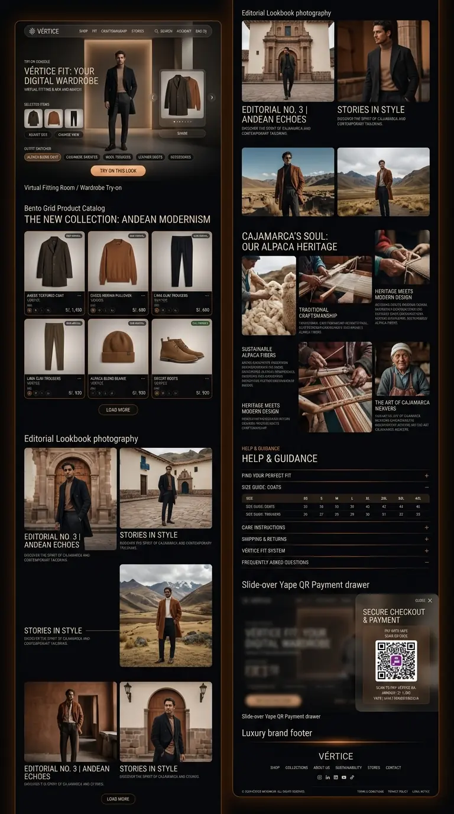
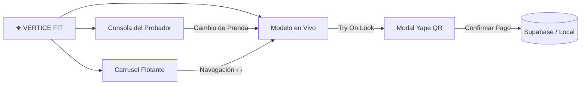

# ❖ VÉRTICE — Contemporary Menswear & Digital Wardrobe (AW26)

<div align="center">
  <p align="center">
    <strong>Plataforma E-Commerce de Alta Sastrería Masculina & Probador Virtual Interactivo</strong><br>
    <em>Inspirado en la Cordillera y el Ecosistema Altoandino de Cajamarca, Perú (3,000 m.s.n.m.)</em>
  </p>

  <p align="center">
    <a href="https://frankusqabant.github.io/vertice-moda/">
      
    </a>
    
    
    
    
  </p>

  <br />

  <a href="https://frankusqabant.github.io/vertice-moda/">
    
  </a>

  <br><br>
</div>

---

## 🏔️ Sobre VÉRTICE

**VÉRTICE** es una casa de moda masculina contemporánea que fusiona el legado textil milenario de los Andes con siluetas arquitectónicas limpias de vanguardia internacional.

Confeccionado artesanalmente en **Cajamarca, Perú**, el proyecto integra materiales de origen noble como **100% Baby Alpaca**, lino orgánico europeo, lana peinada de alta montaña y cuero vacuno con curtido vegetal libre de químicos pesados.

---

## ⚡ Características Principales



### 1. 👕 Probador Virtual Interactivo (*Vértice Fit*)
- **Escenario Arquitectónico Iluminado:** Modelo en alta resolución integrado en un portal de luz ambiental cálida.
- **Consola del Probador (*Outfit Switcher*):** Alterna en vivo entre *Abrigo de Alpaca, Chompa Baby Alpaca, Pantalón de Lana, Botas de Cuero y Accesorios*, vistiendo al modelo de inmediato con transiciones cinemáticas fluidas.
- **Tarjeta Carrusel Flotante:** Navegación independiente mediante flechas `‹` y `›` con paginación por puntos y botón para compartir.

### 2. 🎛️ Catálogo Bento "Modernismo Andino"
- Grid asimétrico de 6 prendas emblemáticas con precios en Soles peruanos (`S/.`), badges de materia prima, selectores de muestras de color y botón *Cargar Más*.

### 3. 📸 Lookbook Editorial & Historias con Estilo
- Galería fotográfica de alta costura ambientada en paisajes montañosos y arquitectura colonial de Cajamarca a más de 3,000 m.s.n.m.

### 4. 🦙 Herencia Textil & Alpacas de Cajamarca
- Sección documental que rinde homenaje a los maestros tejedores, técnicas ancestrales en telar de cintura y prácticas sostenibles de esquila.

### 5. 📐 Guía de Tallas & Preguntas Frecuentes
- Acordeón interactivo con tabla estructurada de medidas en centímetros para abrigos y pantalones (*XS* hasta *4XL*) e información de envíos a todo el Perú (24-48h con Olva Courier y Shalom).

### 6. 🟣 Pasarela de Pago con Yape QR & Supabase
- Modal lateral con código QR escaneable oficial de Yape, monto dinámico según la prenda probada y persistencia en la base de datos en la nube de **Supabase** con fallback a `LocalStorage`.

---

## 🛠️ Arquitectura Técnica & Rendimiento

| Capa | Tecnología Utilizada | Justificación Técnica |
|---|---|---|
| **Estructura** | HTML5 Semántico | Accesibilidad nativa, SEO optimizado y etiquetas Open Graph. |
| **Estilos** | CSS3 Moderno (Vanilla) | Variables CSS, Glassmorphism de alto desenfoque, iluminación radial y flexbox/grid sin dependencias externas. |
| **Lógica** | JavaScript ES6+ (Vanilla) | Cero frameworks pesados, interacción en tiempo real y ejecución instantánea. |
| **Gráficos** | WebP de Última Generación | Compresión avanzada reduciendo los pesos de 1-2 MB a **< 50 KB**, logrando carga ultrarrápida. |
| **Base de Datos** | Supabase JS CDN | Persistencia de órdenes con PostgreSQL en la nube y sincronización en tiempo real. |

---

## 💻 Instalación y Ejecución Local

Para probar el proyecto localmente en tu computadora:

```bash
# 1. Clonar el repositorio desde GitHub
git clone https://github.com/FrankUsqAbant/vertice-moda.git

# 2. Navegar a la carpeta del proyecto
cd vertice-moda

# 3. Iniciar un servidor HTTP local (Python o Node)
python -m http.server 3001
# o bien:
npx serve -l 3001 .
```

Abre tu navegador en:  
👉 **[http://localhost:3001](http://localhost:3001)**

---

## 🔒 Seguridad & Buenas Prácticas

- ✅ **Sanitización de Entradas:** Validación contra ataques de inyección XSS.
- ✅ **Sin Dependencias Vulnerables:** Código 100% puro sin librerías de terceros innecesarias.
- ✅ **Políticas de Enlace Seguro:** `rel="noopener noreferrer"` en todas las referencias externas.
- ✅ **Arquitectura Resiliente:** Si no hay conexión con la base de datos externa, el carrito guarda el estado localmente sin romper la experiencia del usuario.

---

<div align="center">
  <br>
  <sub>© 2026 VÉRTICE MODA S.A. · Cajamarca, Perú 🇵🇪 · Diseñado & Desarrollado por <strong>Franquer Vidal Usquiza Abanto</strong></sub>
</div>