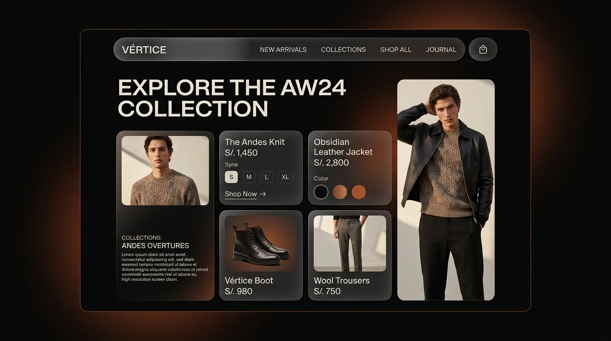

# ❖ VÉRTICE — Contemporary Menswear & Digital Wardrobe (AW26)

  

    <strong>Plataforma E-Commerce de Alta Sastrería Masculina & Probador Virtual Interactivo</strong> 
    <em>Cajamarca, Perú (3,000 m.s.n.m.)</em>
  

  

    
    
    
    
  

   

  

---

## 🏔️ Sobre el Proyecto

**VÉRTICE** es una plataforma web de moda masculina contemporánea que fusiona el legado textil milenario de los Andes con diseño arquitectónico de vanguardia. Confeccionado en **Cajamarca, Perú** utilizando **100% Baby Alpaca**, lino orgánico y cuero con curtido vegetal.

> 🌐 **Sitio Web Oficial:** [https://frankusqabant.github.io/vertice-moda/](https://frankusqabant.github.io/vertice-moda/)

---

## ⚡ Características Principales

- 👕 **Probador Virtual Interactivo (*Vértice Fit*):** Cambia de prenda en vivo sobre el modelo en un escenario de estudio con iluminación ambiental.
- 🎛️ **Catálogo Bento "Modernismo Andino":** 6 prendas emblemáticas con precios en Soles (`S/.`) y selectores de color.
- 📸 **Lookbook Editorial:** Fotografía de alta costura ambientada en paisajes cajamarquinos.
- 🦙 **Herencia Textil:** Documental interactivo sobre el hilado tradicional en telar.
- 📐 **Guía de Tallas & FAQ:** Acordeón con tabla estructurada de medidas en centímetros (*XS* a *4XL*).
- 🟣 **Modal de Pago Yape QR:** Código QR escaneable oficial para pagos directos y registro en **Supabase** (con fallback local).

---

## 🌐 Acceso al Proyecto en Producción

El proyecto se encuentra alojado y disponible públicamente en **GitHub Pages**:

👉 **[https://frankusqabant.github.io/vertice-moda/](https://frankusqabant.github.io/vertice-moda/)**

---

  © 2026 VÉRTICE MODA S.A. · Cajamarca, Perú 🇵🇪 · Desarrollado por <strong>Franquer Vidal Usquiza Abanto</strong>

